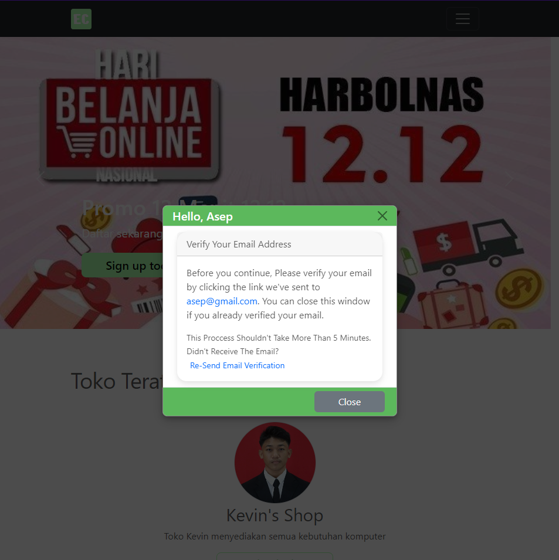

## EZ-Commerce Project Description

> Update: We now have real project demo! Visit this project demo at: [ezcommerce.drmproject.my.id](https://ezcommerce.drmproject.my.id)
> Test payment [https://simulator.sandbox.midtrans.com/](https://simulator.sandbox.midtrans.com/)

### Overview

EZ-Commerce is an innovative e-commerce platform designed to simplify the online shopping experience for both customers and merchants. The platform offers a comprehensive suite of features that enable seamless product management, user interaction, secure transactions, and personalized shopping experiences.

### Usage
1. Clone the project `git clone https://github.com/kevintherm/ez-commerce`
2. Install dependencies `composer install`
3. Copy `.env.example` to `.env`: `cp ./env.example ./env`
4. Generate application key `php artisan key:generate`
5. Migrate database, make sure you have the db 'tokonline' `php artisan migrate:fresh --seed`
6. Run artisan serve `php artisan serve`
7. Go to your localsite

### Key Features

#### 1. Cart Feature
The cart feature allows customers to effortlessly add, remove, and manage items in their shopping cart, providing a user-friendly interface for a smooth shopping experience.

#### 2. Dashboard for Products
Merchants can easily manage their product listings through a robust dashboard. The dashboard offers intuitive controls for adding, editing, and organizing products.

#### 3. Discussion Feature
The discussion feature facilitates customer engagement by allowing users to ask questions and share reviews directly on product pages. This interactive element helps build community and trust. Dummy data is shown bellow.

#### 4. Multi-User Shop
EZ-Commerce supports multi-user functionality, enabling multiple sellers to manage their shops on the same platform. Each seller has dedicated access to manage their inventory and sales.

#### 5. Payment Feature
Secure and efficient payment processing is integral to EZ-Commerce. The platform supports multiple payment gateways to ensure smooth and secure transactions for customers.

#### 6. Profile Edit
Users can personalize their shopping experience by editing their profiles. The profile edit feature allows users to update their information, preferences, and settings with ease.

#### 7. Email Verification
To enhance security and trust, EZ-Commerce includes an email verification feature. This ensures that all users on the platform have verified their email addresses, adding an extra layer of security.

### Conclusion

EZ-Commerce is designed to provide a comprehensive and user-friendly e-commerce experience. With its rich feature set and focus on usability and security, it aims to be the go-to platform for online shopping and sales management. Whether you're a customer looking for a seamless shopping experience or a merchant wanting efficient shop management tools, EZ-Commerce has you covered.

## License

The app is open-sourced software licensed under the [MIT license](https://opensource.org/licenses/MIT).
